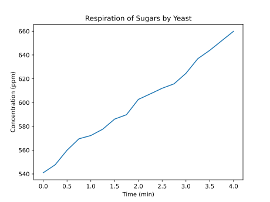

# OpenCMBL
## Overview
This package allows for extraction of data from .cmbl files generated by Vernier LoggerPro. The primary purpose of Vernier's software is to interface with their instrumentation controllers, making the software itself quite valuable. However, the data manipulation tools available in the software are fairly limited, and exporting the data a CSV can be inconvenient in some situation, therefore there was a need to write a module for processing these files.
## Classes
### The `cmbl` class
This class represents the data in the file. it contains a number of attributes which directly reference tags in the XML structure of the .cmbl file. The main purpose of this class is to transport the numerical data from the .cmbl to python lists. This conversion is done automatically once the file is loaded.
### The `DataSet` class
The primary building block of .cmbl is the `<DataSet>` xml tag. These sets contain the numerical data as well as its associated metadata. The DataSet class is a minimal representation of this element, as much of the data stored in the file has to do with how it is displayed in LoggerPro.
### The `Column` class
The simplest class, represents a single column in the file, just a list associated with a string representing the unit of the data.
## Example Usage
### Accessing properties
```python
import opencmbl
file = opencmbl.cmbl("filename.cmbl")
print(file.creationDate)
print(file.encoding)
```
yields: 
```
04/03/03 15:14:09
utf-8
```
### Plotting
```python
import opencmbl
from matplotlib import pyplot as plt
f = opencmbl.cmbl("filename.cmbl")
title = f.graphTitle #get the title of the graph

#get the data and unit for the x axis
xdata = f.data[0].columns[0].data
xunit = f.data[0].columns[0].unit

#get the data and unit for the y axis
ydata = f.data[0].columns[1].data
yunit = f.data[0].columns[1].unit

#generate the plot with matplotlib
fig,axs = plt.subplots(1)
axs.plot(xdata,ydata)
axs.set_xlabel("Time (%s)" % xunit)
axs.set_ylabel("Concentration (%s)" % yunit)
axs.set_title(title)
plt.show()
```
yields:<br>
</img>
***
Licensed under the [MIT License](https://opensource.org/licenses/MIT) &#169; 2021 Tom Powell
